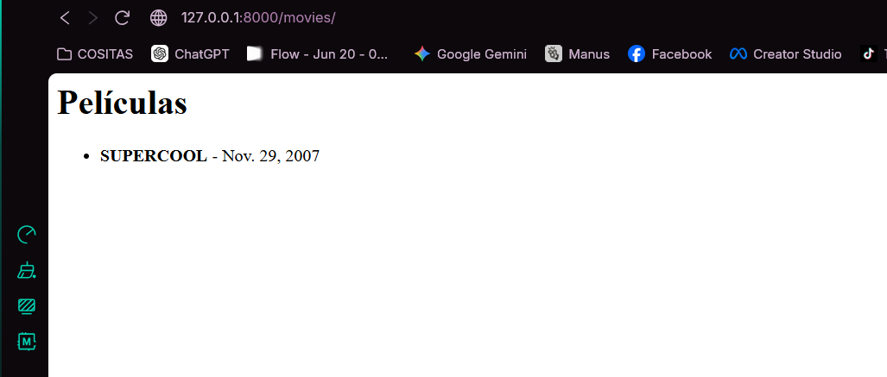

# William Julon Mejia 

## creación de repositorio

## creacion del entorno virtual

## Ejecucion del Proyecto

## Creacion de la primera aplicacion

## Administracion de Entidades

## Creacion de Front simple

## Implementación de API REST (Django REST Framework)

## Consumo de la API

## Listado de Movies (GET)

