# Implementación de API REST (Django REST Framework)
---
## William Julon Mejia 
## Alexander Sanabria
## Gabriel Llanos

---

# William Julon Mejia - Capturas

## Consumo de la API

## Listado de Movies 

## Listado de Movies (GET)

---

## Registrar Movie (POST)

---

## Reemplazar Movie (PUT)

---

## Actualizar parcialmente Movie (PATCH)

---

## Borrar Movie (DELETE)

# Alexander Sanabria - Capturas

### API ROOT

---
### Listado de peliculas

---
## ENDPOINTS
### GET

### BD Get

---

### POST

### BD Post

---

### PUT

### BD Put

---

### PATCH

### BD Patch

---

### DELETE

### BD Delete

# Gabriel Llanos Pacheco - Capturas

## API ROOT

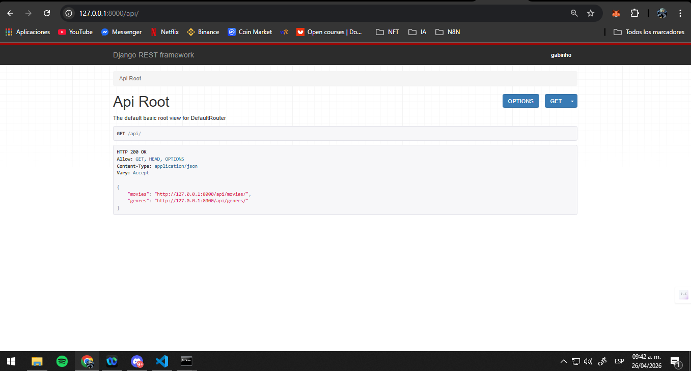

## Listado de Genres

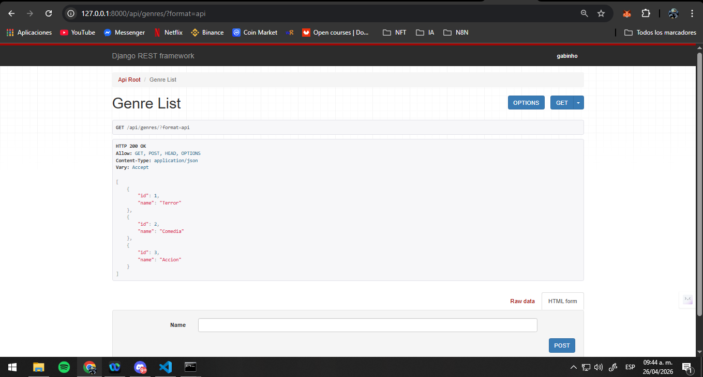

## GET - Genres

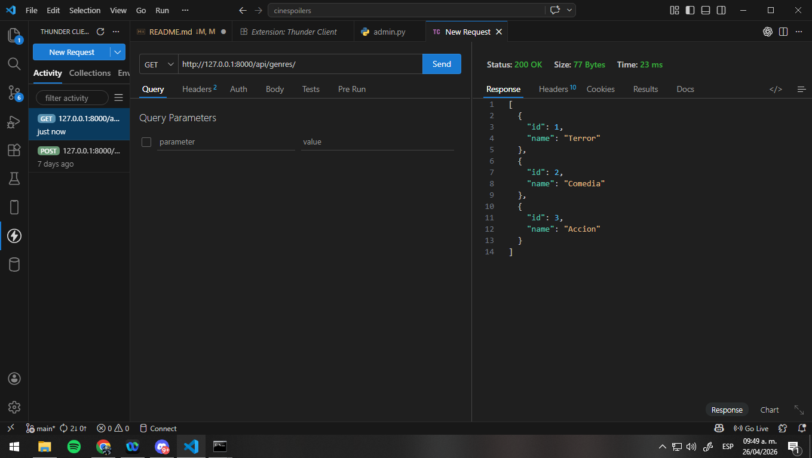

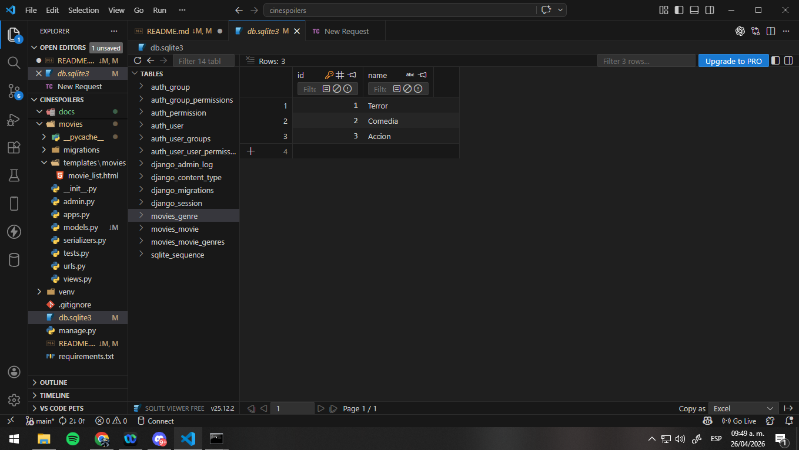

---

## POST - Genres

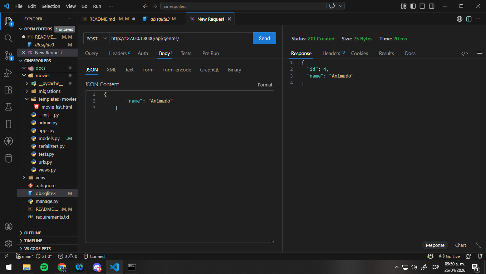

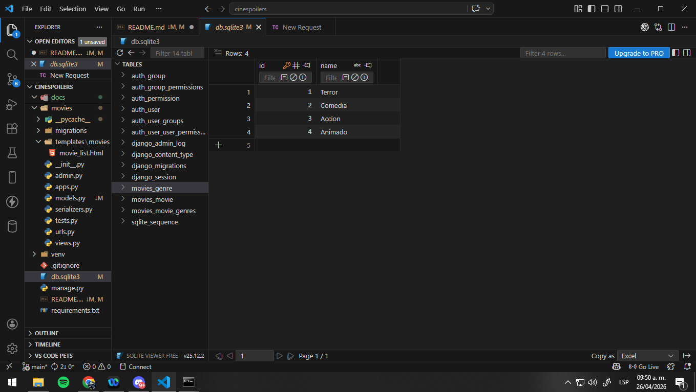

---

## PUT - Genres

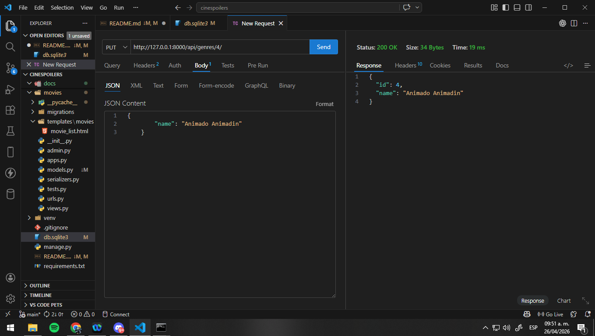

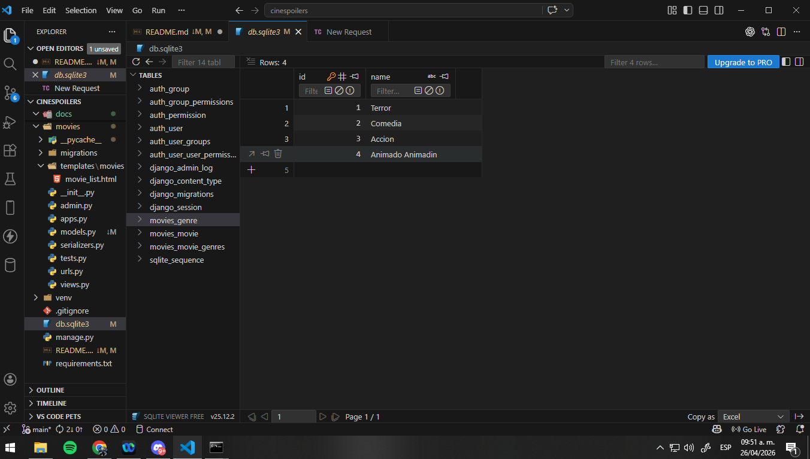

---

## PATCH - Genres

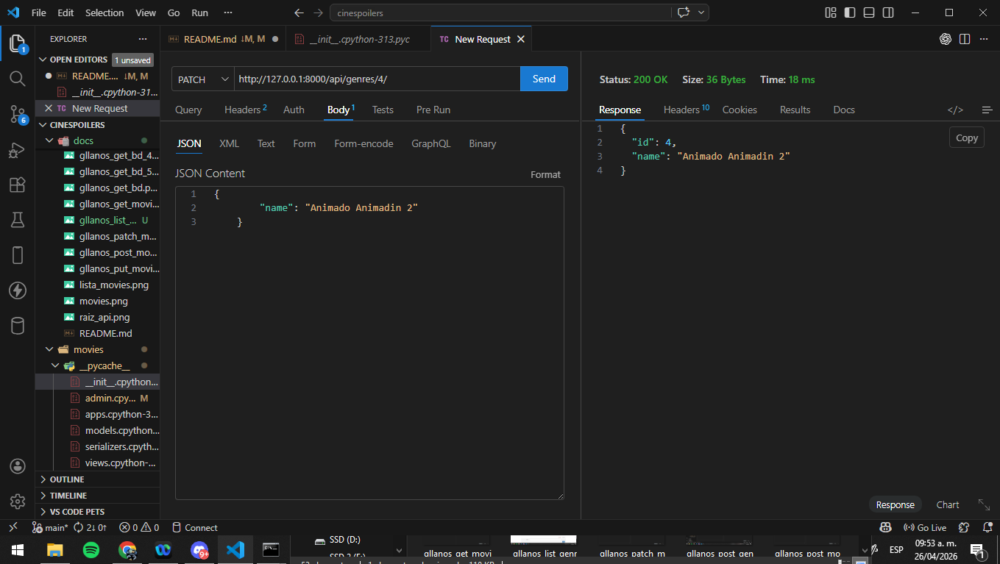

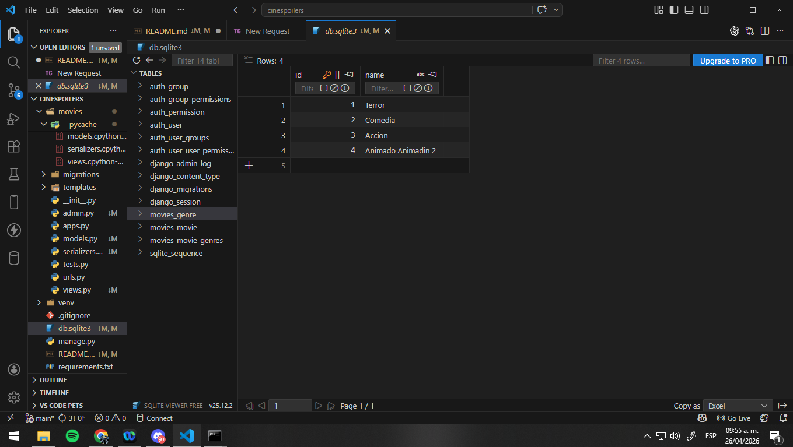

---

## DELETE - Genres

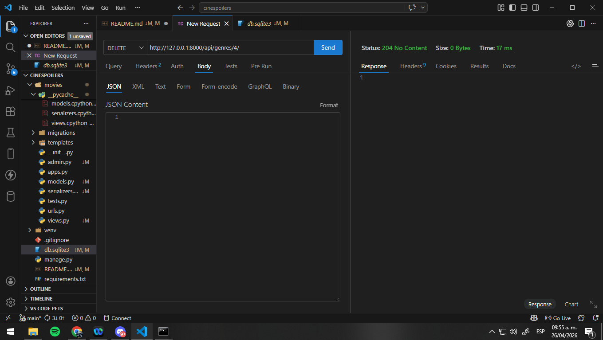

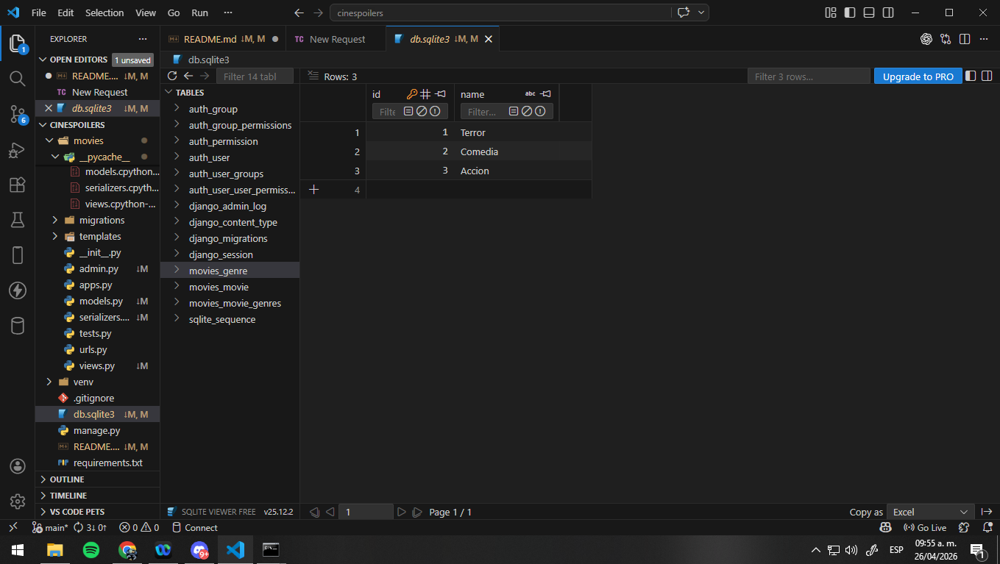

