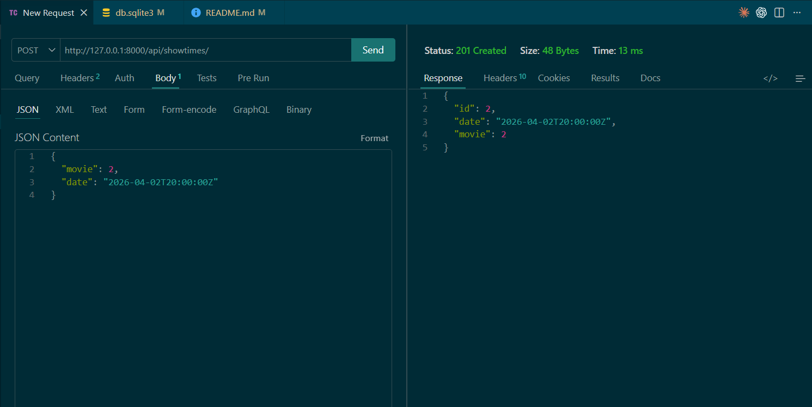
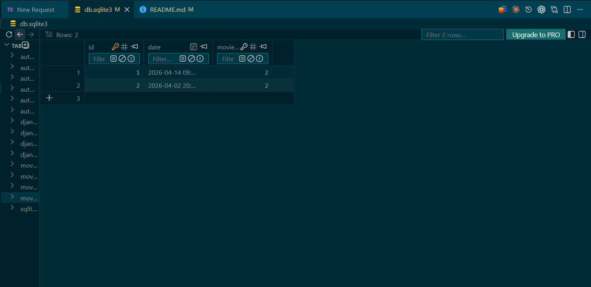
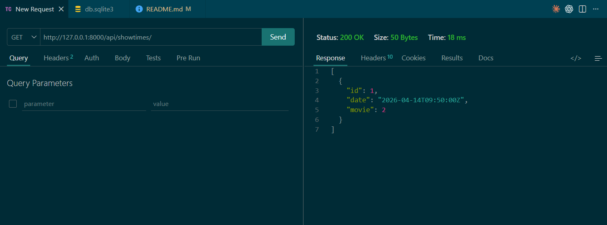
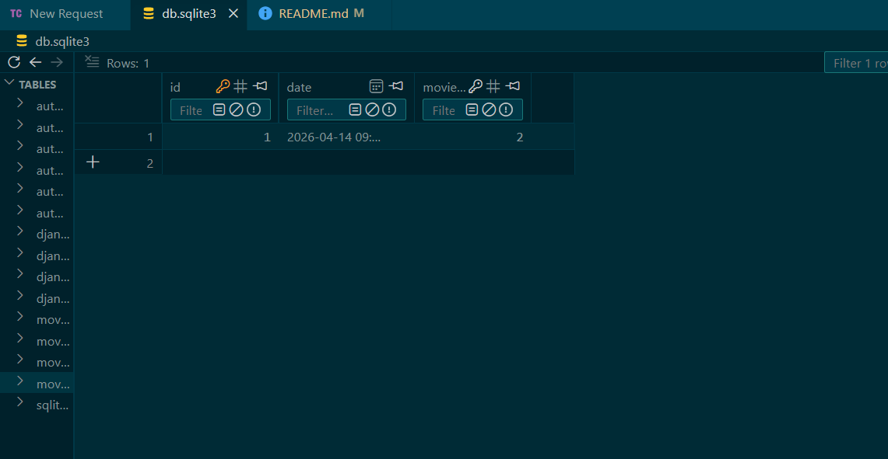
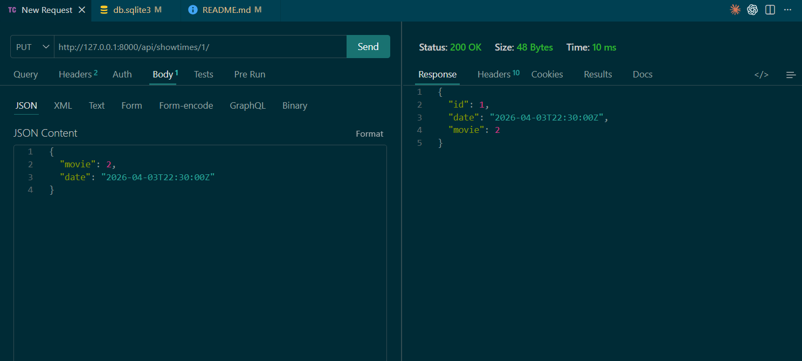
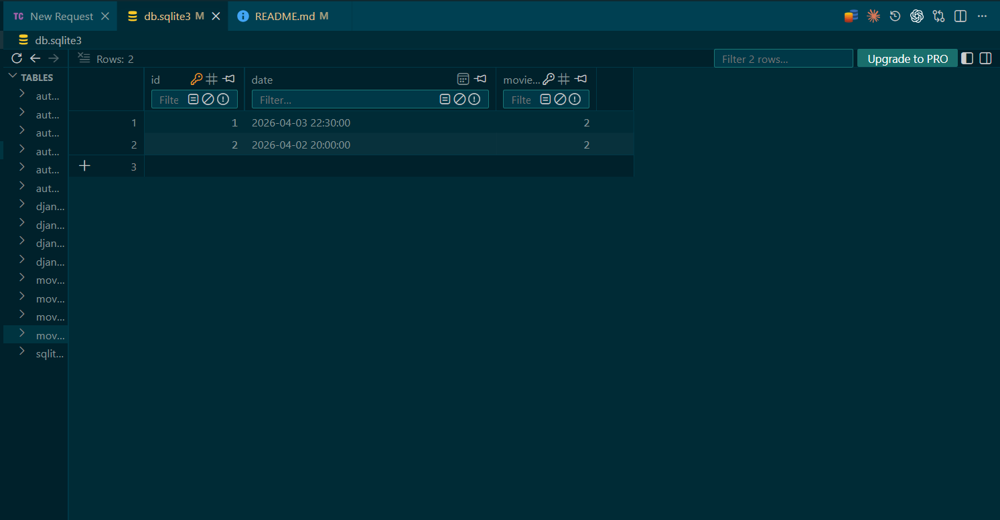
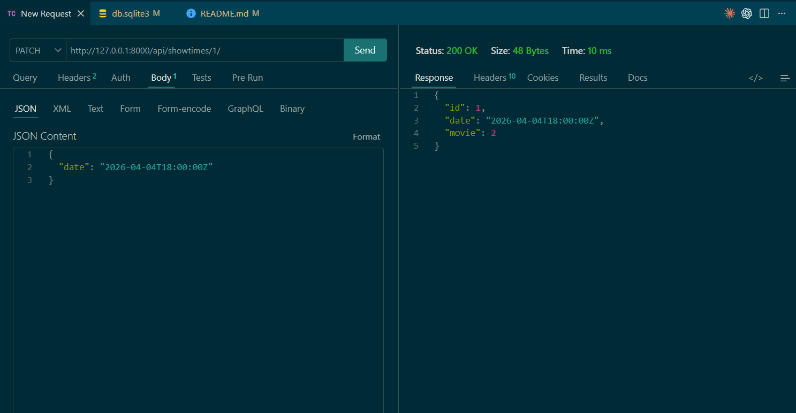
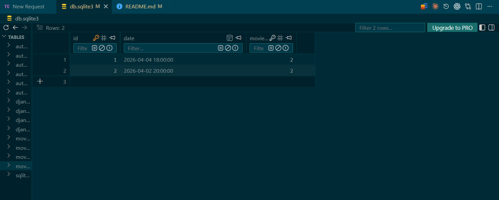
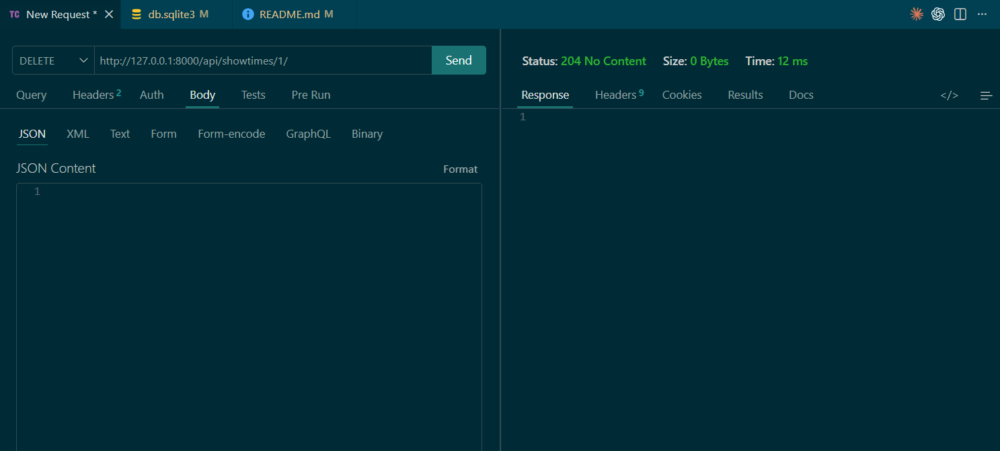
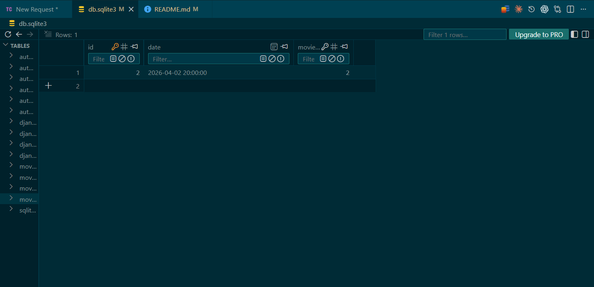

# Implementación de API REST (Django REST Framework)
---
## William Julon Mejia 
## Alexander Sanabria
## Gabriel Llanos

---

## Ejecución del proyecto (clonado)

### 1. Clonar repositorio

```bash
git clone https://github.com/ING-VladBill/cinespoilers
cd cinespoilers

2. Crear entorno virtual
python -m venv venv

3. Activar entorno virtual (Windows)
venv\Scripts\activate

4. Instalar dependencias
pip install -r requirements.txt

5. Aplicar migracionesgit status
python manage.py migrate

6. Crear superusuario (opcional)
python manage.py createsuperuser

7. Ejecutar servidor
python manage.py runserver

8. Acceder al sistema
API Root: http://127.0.0.1:8000/api/

Movies API: http://127.0.0.1:8000/api/movies/

Admin: http://127.0.0.1:8000/admin/
```
## Showtime/funciones - William Julon Mejia

### POST: http://127.0.0.1:8000/api/showtimes/



### GET: http://127.0.0.1:8000/api/showtimes/



### PUT: http://127.0.0.1:8000/api/showtimes/1/



### PATCH: http://127.0.0.1:8000/api/showtimes/1/



### DELETE: http://127.0.0.1:8000/api/showtimes/1/

